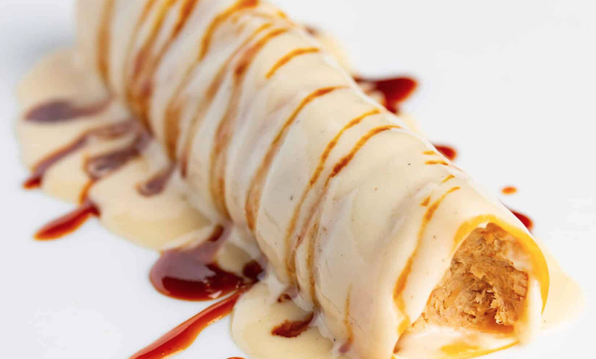

# 🍝 Canelones de la abuela Catalina

✨ **Introducción**  
Un plato tradicional que une la intensidad de las carnes ibéricas con la suavidad de la bechamel. Perfecto para una comida especial.

---

## 🛒 Ingredientes (4 personas)  
- 🫒 **80 g** aceite de oliva  
- 🥩 **600 g** secreto ibérico  
- 🥩 **400 g** presa ibérica  
- 🧅 **700 g** cebolla  
- 🥕 **350 g** zanahorias  
- 🍷 **180 ml** vino rancio  
- 💧 **1,5 L** agua  
- 🍲 **1,5 L** caldo de cocido  
- 🍞 **250 g** pan de molde  
- 🥛 **1 cda** leche (≈15 ml)  
- 🥄 **1 cda** bechamel (≈15 g)  
- 🌾 **75 g** harina  
- 🧈 **75 g** mantequilla  
- 🥛 **500 ml** leche  
- 🍖 **500 ml** jugo de cocción  
- 🧂 Sal y pimienta al gusto  
- 🍝 **8** placas de canelón  

---

## 👩‍🍳 Elaboración  
1. Cortamos los **600 g de secreto ibérico** y los **400 g de presa ibérica** en dados de 5 cm, salpimentamos, marcamos en los **80 g de aceite de oliva** y retiramos.   
2. Pochamos los **700 g de cebolla** y los **350 g de zanahoria**.  
3. Desglasamos con los **180 ml de vino rancio**, reducimos y añadimos las carnes. Cubrimos con **1,5 L de agua** y **1,5 L de caldo de cocido**. Guisamos 2 h.  
4. Retiramos carne y verduras, trituramos, colamos la salsa y desgrasamos.  
5. Remojamos los **250 g de pan** en la cucharada de leche. Mezclamos con la carne, un poco de salsa y **1 cda de bechamel**. Rellenamos los **8 canelones**.  
6. Para la bechamel: hacemos un roux con **75 g de harina** y **75 g de mantequilla**. Añadimos los **500 ml de leche** y los **500 ml de jugo de cocción**. Cocinamos hasta espesar.  
7. Cubrimos los canelones con bechamel, horneamos hasta que estén calientes y gratinamos.  

---

👉 **Sirve inmediatamente, bien calientes y gratinados 🧀🔥.**

---

📌 **Fuente / Créditos:**  
Receta original adaptada de [FISAN – Canelón de nuestra abuela Catalina](https://www.fisan.com/gastronomia/recetas-alta-gastronomia/canelon-fisan-de-nuestra-abuela-catalina/).
