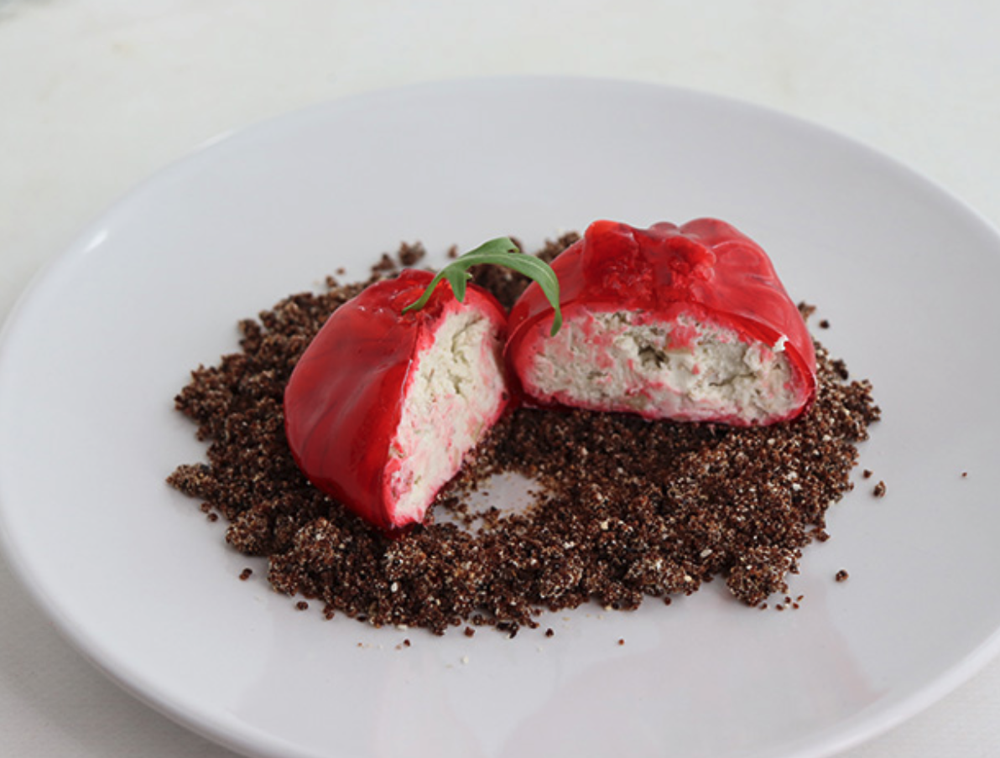

# 🍅 Falsos Tomates RAF rellenos de queso y nueces

✨ **Introducción**  
Un aperitivo sorprendente, con apariencia de tomate RAF pero en realidad relleno de quesos y nueces. Ideal para fiestas o mesas especiales.  

---

## 🛒 Ingredientes (≈10 unidades)  

**🌱 Tierra**  
- 20 g galletas crackers  
- 40 g ciruelas pasas  
- 10 g mantequilla  

**🍅 Tomatitos**  
- 200 g queso crema para untar  
- 200 g queso roquefort  
- 50 g nata líquida para montar  
- 60 g nueces picadas  
- Hojas de perejil o rúcula (decoración)  

**🟥 Baño rojo**  
- 100 g vino dulce  
- 100 g agua  
- 25 g azúcar  
- 8 g agar-agar  
- 8–10 gotas colorante rojo  

---

## 👩‍🍳 Elaboración  

1. **Tierra**: trituramos los **20 g de crackers**, **40 g de ciruelas pasas** y **10 g de mantequilla** hasta obtener una arena fina. Reservamos.  
2. **Tomatitos**: mezclamos los **200 g de queso crema**, los **200 g de roquefort**, los **50 g de nata** y las **60 g de nueces**. Formamos bolas con ayuda de film transparente, cerrando con un nudo para dar forma irregular de tomate. Congelamos.  
3. **Baño rojo**: calentamos en un cazo los **100 g de vino dulce**, **100 g de agua**, **25 g de azúcar**, **8 g de agar-agar** y el colorante rojo. Removemos hasta disolver y mantener a 90 ºC unos 3 min.  
4. **Bañado**: sacamos los tomatitos del congelador, retiramos el film, los pinchamos con una brocheta y los sumergimos en el baño rojo. Escurrimos y dejamos secar sobre papel sulfurizado.  
5. **Montaje**: colocamos un poco de tierra en el plato, encima el tomatito y coronamos con una hoja de perejil o rúcula.  

---

👉 Resultado: unos falsos tomates de aspecto realista, sabor intenso y textura sorprendente 😋.  

---

📌 **Fuente / Créditos:**  
Receta original adaptada de [Cocinando entre olivos – “Falsos” Tomates raf rellenos de queso y nueces](https://cocinandoentreolivos.com/2021/12/falsos-tomates-raf-rellenos-de-queso-y-nueces.html).
