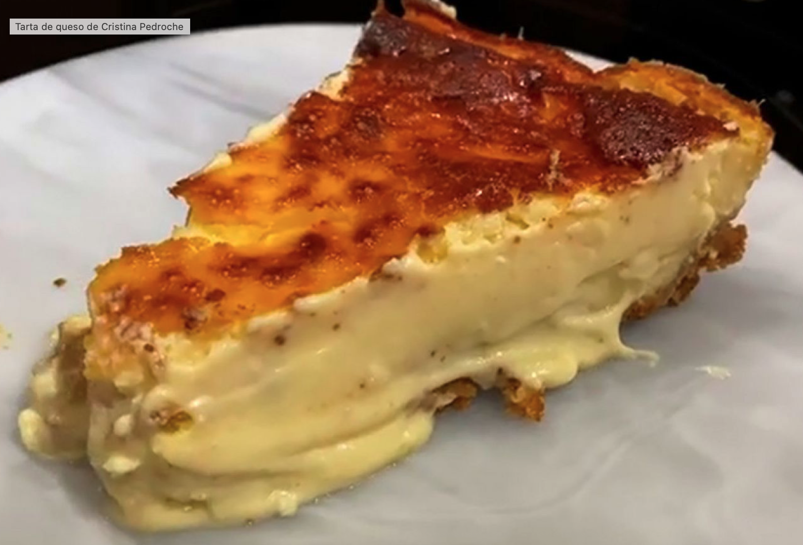

# 🍰 Tarta de queso de la Pedroche

✨ **Introducción**  
Una de las tartas de queso más famosas de España. Cremosa, irresistible y con ese toque fluido en el centro que la hace única.  

---

## 🛒 Ingredientes  
- 🧀 **500 g** queso crema  
- 🥛 **250 g** nata (35% materia grasa)  
- 🥚 **5 huevos** + un poco de sal  
- 🧀 **100 g** queso fresco  
- 🧀 **80 g** queso parmesano  
- 🍬 **200 g** azúcar  
- 🌾 **10 g** harina  
- 🍪 Galletas trituradas (≈200 g, según molde)  
- 🧈 Mantequilla fundida (≈100 g, para la base)  

---

## 👩‍🍳 Elaboración  
1. Batimos los **500 g de queso crema**, los **250 g de nata**, los **5 huevos con sal**, los **100 g de queso fresco**, los **80 g de parmesano** y los **200 g de azúcar** hasta obtener una mezcla homogénea.  
2. Añadimos los **10 g de harina** y mezclamos de nuevo.  
3. Trituramos ≈**200 g de galletas** y las unimos con ≈**100 g de mantequilla fundida** hasta formar una pasta.  
4. Cubrimos el molde con la base de galleta (≈1 cm de grosor) y vertemos la mezcla de queso encima.  
5. Horneamos en horno precalentado a **190 ºC con ventilador** durante **30 min**.  
6. Subimos a posición grill, máxima potencia, y gratinamos **3–4 min** hasta dorar la superficie.  
7. Dejamos reposar al menos **3 horas** en un lugar fresco o en la nevera.  

---

👉 Resultado: textura cuajada en los bordes y centro cremoso que se funde en la boca 🤤❤️.  

---

📌 **Fuente / Créditos:**  
Adaptado de la receta compartida por *Cristina Pedroche* en redes sociales.  
